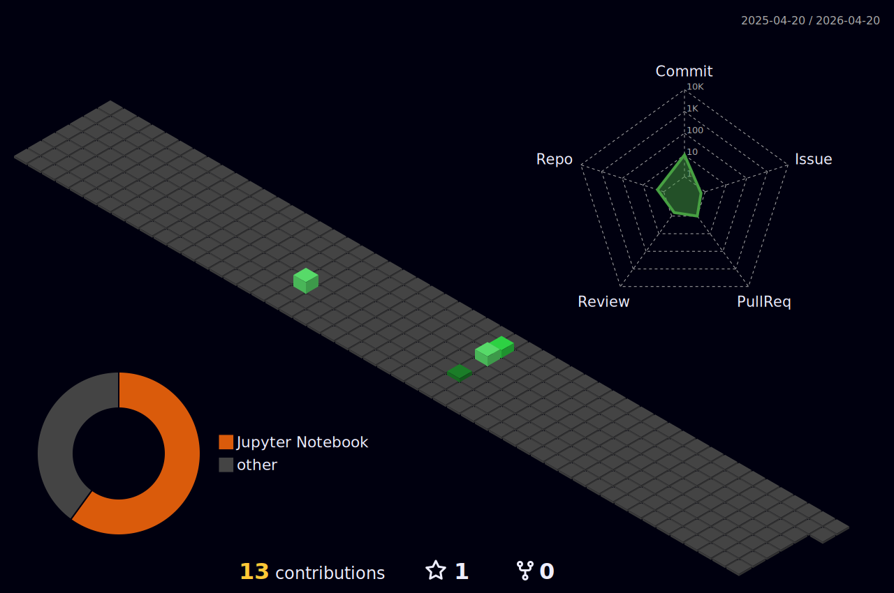

<h3 align="center"> I'm Shrish. I'm a high-school student with interests in code and artificial intelligence. </h1>

<p align="center">
  &nbsp;&nbsp;&nbsp;
  &nbsp;&nbsp;&nbsp;
  &nbsp;&nbsp;&nbsp;
  
</p>

<p align="center">
    <a href="https://git.io/streak-stats">
        
    </a>
</p>

---

<p align="center" style="font-size: 16px; font-weight: bold; color: #FFFFFF; font-family: 'Roboto', sans-serif;">
  <a href="https://github.com/marketplace/actions/quote-readme" style="text-decoration: none; color: inherit;">
    <!--STARTS_HERE_QUOTE_README-->
    <i>❝Amazon was a hard cover book seller, but actually now sells more e-books than hard covers❞</i>
    <!--ENDS_HERE_QUOTE_README-->
  </a>
</p>

---

## 📈 Statistics
  <p align="center">
    <a href="https://github.com/marketplace/actions/waka-readme">
      <!--START_SECTION:waka-->

```txt
Total Time: 2 hrs 39 mins

Markdown   2 hrs 25 mins   >>>>>>>>>>>>>>>>>>>>>>>--   90.90 %
YAML       14 mins         >>-----------------------   09.10 %
```

<!--END_SECTION:waka-->
    </a>
  </p>
<a href="https://github.com/anuraghazra/github-readme-stats">
  
</a>



## :zap: Recent activity

  <!--START_SECTION:activity-->
  <!--END_SECTION:activity-->