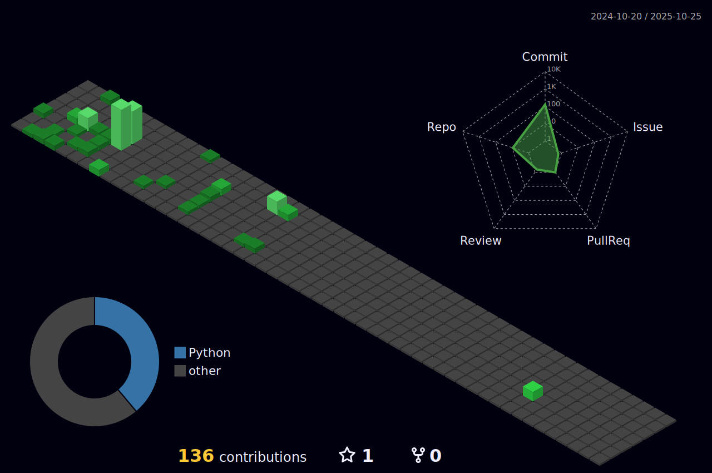

<h3 align="center"> I'm Shrish. I'm a high-school student with interests in code and artificial intelligence. </h1>

<p align="center">
  <a href="https://www.python.org/">
    
  </a>&nbsp;&nbsp;&nbsp;
  <a href="mailto:shrishpanda2@gmail.com">
    
  </a>&nbsp;&nbsp;&nbsp;
  <a href="https://www.codewars.com/users/The-Indian-Coder-20">
    
  </a>&nbsp;&nbsp;&nbsp;
  <a href="https://www.microsoft.com/en-us/windows">
    
  </a>
</p>

<p align="center">
https://guns.lol/shrizzy
</p>

---

<p align="center" style="font-size: 16px; font-weight: bold; color: #FFFFFF; font-family: 'Roboto', sans-serif;">
  <a href="https://github.com/marketplace/actions/quote-readme" style="text-decoration: none; color: inherit;">
    <!--STARTS_HERE_QUOTE_README-->
<i>❝“Your most unhappy customers are your greatest source of learning.”— Bill Gates   ❞</i>
<!--ENDS_HERE_QUOTE_README-->
  </a>
</p>

---

## 📈 Statistics
  <!--START_SECTION:waka-->

```txt
Total Time: 0 secs

No activity tracked
```

<!--END_SECTION:waka-->

<p align="center">
  
  
  
</p>

---


